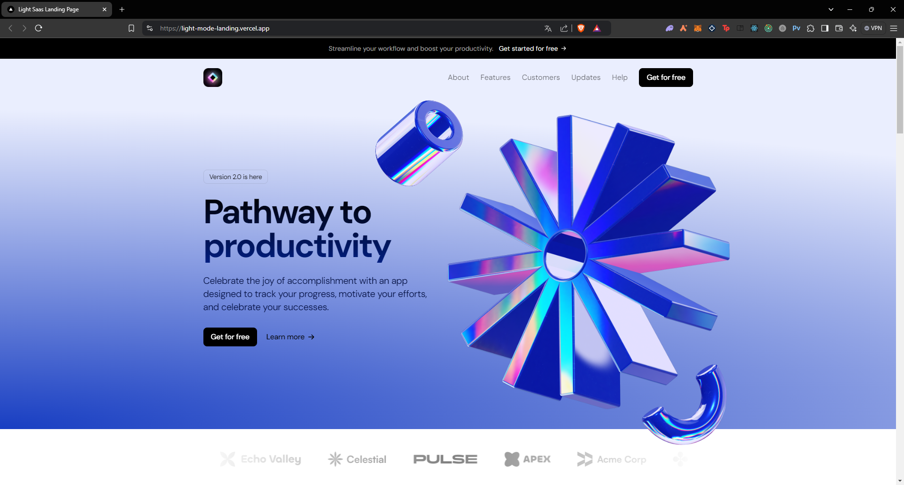
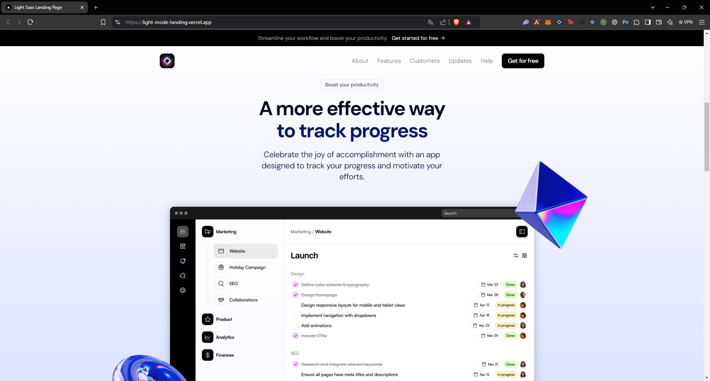
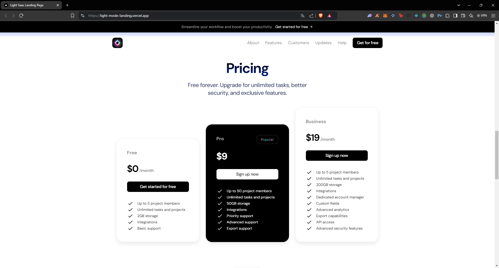
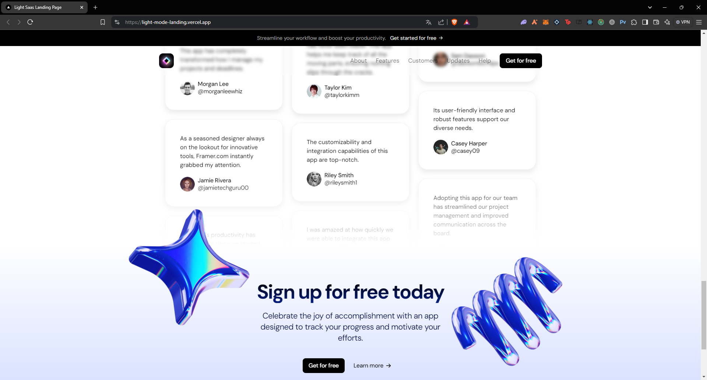

# Landing Page with Next.js, TailwindCSS, Framer Motion, and TypeScript
Demo Link : https://light-mode-landing.vercel.app/
This project is a beautifully crafted landing page built with cutting-edge web technologies, offering an engaging and visually appealing user experience. It leverages the power of **Next.js** for server-side rendering, **TailwindCSS** for responsive styling, **Framer Motion** for smooth animations, and **TypeScript** for robust and type-safe code.

## Features

- **Fully Responsive Design**: Optimized layout for both desktop and mobile devices, ensuring a seamless experience across all screen sizes.
- **Smooth Animations**: Implemented with Framer Motion, the page includes elegant transitions and interactions, enhancing user engagement.
- **TailwindCSS Styling**: Minimal and clean design, with utility-first styling for rapid development and customization.
- **TypeScript Integration**: Ensures the app is scalable and less prone to errors by leveraging static type checking.
  
## Screenshots

### Desktop View 1


### Desktop View 2


### Desktop View 3


### Desktop View 4


## Video Walkthrough


https://github.com/user-attachments/assets/d28fc2a7-122d-4700-bd59-6a8273b85645


## Technologies Used

- **Next.js**: Provides server-side rendering and static site generation for better performance and SEO.
- **TailwindCSS**: Utility-first CSS framework that allows for rapid styling of the page components.
- **Framer Motion**: Powerful motion library used for creating smooth animations and transitions.
- **TypeScript**: Superset of JavaScript that enables static type-checking and improved code reliability.
  
## Key Components

### 1. **Hero Section**
   - A beautifully animated introduction with a catchy headline and a prominent call-to-action button. Smooth entrance animations are powered by Framer Motion, providing a lively experience as users land on the page.

### 2. **Features Section**
   - Highlights the key offerings or features of the product or service. Each feature block slides into view with a subtle animation, making the content engaging and interactive.

### 3. **Testimonials**
   - User testimonials displayed with sleek motion effects, adding credibility and a personal touch to the page.

### 4. **Call to Action (CTA)**
   - Bold and highly visible call-to-action buttons that prompt users to engage further, complete with hover animations and smooth scrolling.

## Installation

To run this project locally:

1. **Clone the repository**:
   ```bash
   git clone https://github.com/Lambersonistaken/light-mode-landing.git
   ```

2. **Navigate to the project directory**:
   ```bash
   cd light-mode-landing
   ```

3. **Install the dependencies**:
   ```bash
   npm install
   ```

4. **Run the development server**:
   ```bash
   npm run dev
   ```

5. **Open your browser** and navigate to `http://localhost:3000` to see the landing page.

## Usage

This landing page is fully customizable and scalable. You can easily modify components, add new sections, or tweak animations and styling based on your needs.

## Future Improvements

- **Backend Integration**: Connect the landing page with a backend service to capture user data or integrate with APIs.
- **Dark Mode**: Add a dark mode feature to enhance the visual experience for users.
- **Accessibility Enhancements**: Improve the accessibility of the page by ensuring it adheres to WCAG standards, providing a better experience for all users.

## Learn More

To learn more about the tools and frameworks used in this project, check out the official documentation:

- [Next.js Documentation](https://nextjs.org/docs)
- [TailwindCSS Documentation](https://tailwindcss.com/docs)
- [Framer Motion Documentation](https://www.framer.com/motion/)
- [TypeScript Documentation](https://www.typescriptlang.org/docs/)
